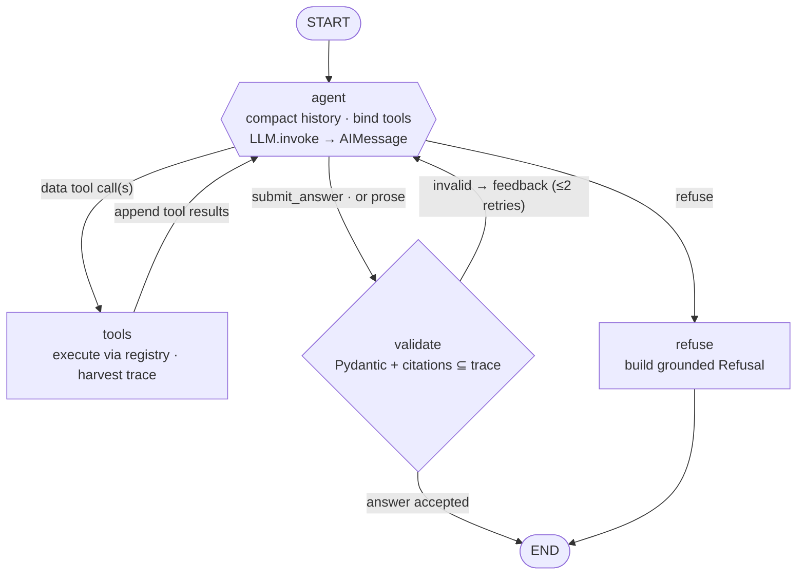
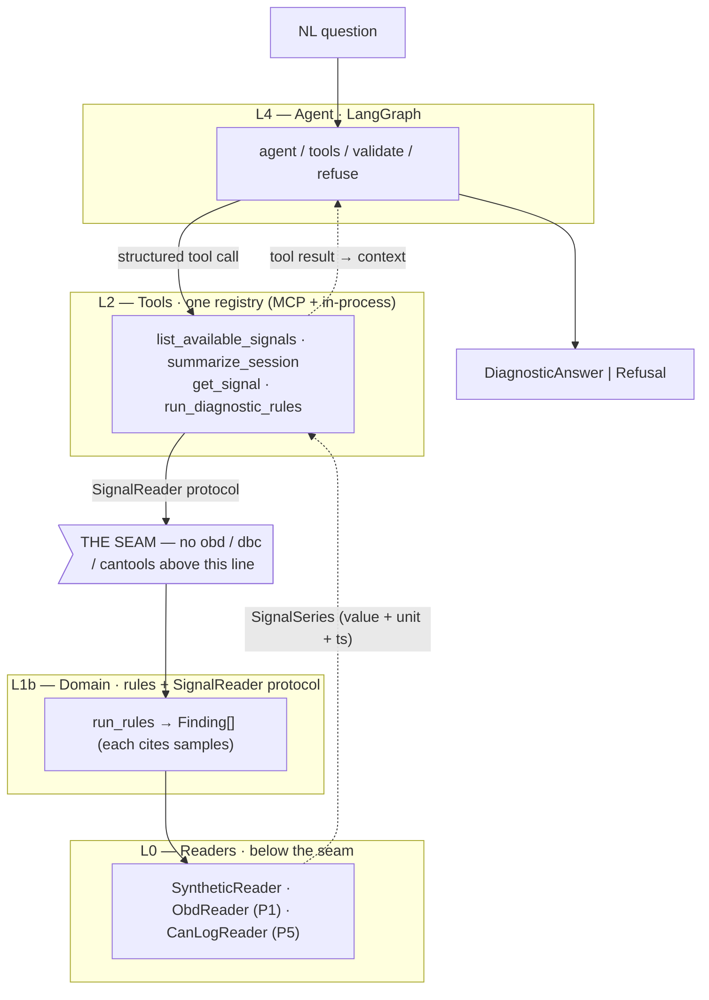
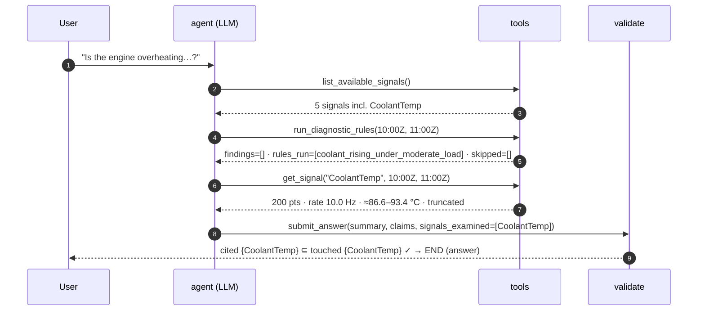
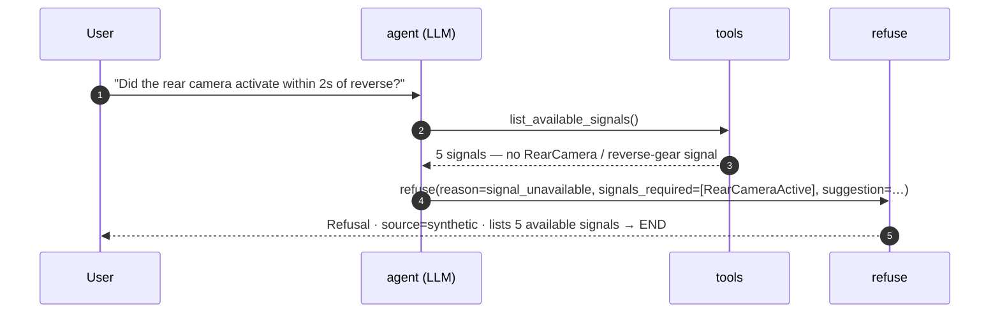

# 09 — AI / LLM Flow (how the agent actually runs)

**Phase:** 3–4 (reflects the shipped `agent/` graph and Phase 4 evals)
**One line:** a natural-language question becomes a validated, evidence-cited answer — or a
grounded refusal — by looping an LLM through four LangGraph nodes and four MCP tools.

This is the visual companion to [`05-agent-orchestration-spec.md`](05-agent-orchestration-spec.md).
Where doc 05 argues the design, this doc *draws* it against the code as shipped
(`src/canopy/agent/graph.py`, `state.py`, `contracts.py`, `prompts.py`, `executor.py`,
`tools/registry.py`). An interactive version with a worked-trace walkthrough is published as
a Claude artifact — see the build log.

> **The one thing to internalise:** the model never touches the data source. It emits a
> *structured tool-call request*; your code executes it and appends the result to the
> conversation. Everything below is a consequence of that split.

---

## 1. The whole loop, one screen

Four nodes — `agent`, `tools`, `validate`, `refuse` — wired with conditional edges. The
`tools → agent` edge is the cycle; the `validate → agent` edge is the retry. Exactly one of
`state.answer` / `state.refusal` is set when the graph reaches `END`.



| node | what it does | key code |
|---|---|---|
| **agent** | The only node that calls the model. Compacts old messages, binds the 4 data tools + `submit_answer` + `refuse`, prepends `SYSTEM_PROMPT`, invokes once. When `iteration ≥ max_iterations` it unbinds the data tools and adds the forced-answer nudge. | `agent_node`, `route_from_agent` |
| **tools** | Executes each requested tool through the shared registry against the `SignalReader`. Harvests the trace as results stream past: `tools_called`, `signals_touched`, `findings`, `skipped`, `signals_available`. | `tools_node` |
| **validate** | Parses `AnswerPayload`; then checks every cited signal is in `signals_touched` (what was *actually* retrieved). Failure → feedback message + bounded retry; exhaustion → code-built `degraded_answer`. | `validate_node`, `route_from_validate` |
| **refuse** | Fills a `Refusal`; `signals_available` comes from a tool result (state) or straight from the source — never from the model. | `refuse_node` |

**Routing out of `agent`** (`route_from_agent`): `submit_answer` in the tool calls → `validate`;
`refuse` → `refuse`; any other tool name → `tools`; prose with no tool call → `validate`
(which turns it into feedback and a retry rather than crashing).

---

## 2. Where it sits — the seam

Everything above the seam is ignorant of whether a number came from an OBD PID or a decoded
CAN frame. The agent reaches data only through the tool registry and the `SignalReader`
protocol, so swapping the reader underneath (synthetic → OBD → raw CAN) changes nothing above.



*Solid = request path (top-down); dashed = normalized data flowing back up as context.*
Enforced by `tests/test_seam.py` (Constraint 1) — passing unchanged through Phase 5 is the
proof the abstraction held.

---

## 3. The tools the model can call

Listed in the cost order the model is meant to read them (`tools/registry.py`) — cheap
orienting calls first, expensive interpretation last. Signatures are the exact Pydantic
input models; a bad argument returns a structured `invalid_arguments` payload, never an
exception (Constraint 3). Required fields marked `*`.

### Data tools

| # | tool | parameters | returns |
|---|---|---|---|
| 1 | `list_available_signals()` | *(none)* | `source`, `signals[] {name, unit, typical_range, description}` |
| 2 | `summarize_session(…)` | `start*` datetime, `end*` datetime | `duration_s`, `signals_present[]`, `sample_counts{}`, `coverage_gaps[]`, `finding_counts{}` |
| 3 | `get_signal(…)` | `name*` str (exact, case-sensitive), `start*` datetime, `end*` datetime, `max_samples` int = 200 (1–1000) | `series`, `truncated`, `actual_sample_rate_hz`, `note` |
| 4 | `run_diagnostic_rules(…)` | `start*` datetime, `end*` datetime, `rule_ids` list[str]? (omit = all applicable) | `findings[]`, `rules_run[]`, `skipped[]` |

- **`list_available_signals`** is the orientation tool — the mechanism by which the agent
  can *know what it cannot answer*.
- **`get_signal`**: `actual_sample_rate_hz` is `null` on a point read — a signal not to run
  timing analysis on. Series over `max_samples` are decimated (`truncated=true`).
- **`run_diagnostic_rules`**: `skipped` ≠ empty `findings`. An empty findings list next to a
  non-empty `skipped` list means "we didn't look," not "nothing is wrong."

### Control tools — the answer travels as a tool call

Structured output arrives through the tool-call channel (doc 06). The model fills only the
judgment fields; the code injects the facts it already knows (`source`, the question, the
available-signal list).

| tool | routes to | parameters (model-filled) | code adds |
|---|---|---|---|
| `submit_answer(AnswerPayload)` | **validate** | `summary*` (≤500), `claims*` (each: `statement`, **`citations ≥ 1`**, `confidence` high/med/low), `signals_examined*`, `findings_referenced`, `could_not_determine` | `source` → `DiagnosticAnswer` |
| `refuse(RefusalPayload)` | **refuse** | `reason*` (`signal_unavailable` / `insufficient_sample_rate` / `time_range_not_covered` / `channel_not_captured`), `signals_required*`, `suggestion` | `source`, `signals_available` → `Refusal` |

`min_length=1` on `citations` makes an uncited claim *impossible to serialize* — grounding
enforced by the type system, not by hoping the system prompt worked (Constraint 4).

---

## 4. How the loop is guaranteed to end

Termination is engineered, not hoped for. Three ways out — none of them a crash.

| exit | trigger | behaviour |
|---|---|---|
| **A — model answers** | `submit_answer` validates | `answer` set → `END`. The normal path. |
| **B — cap trips** | `iteration ≥ max_iterations` (default **8**) | One final turn with data tools *unbound* + `FORCED_ANSWER_PROMPT`: answer honestly from what was retrieved. A degraded-but-honest answer, never an exception. |
| **C — grounded refusal** | source can't provide the signal | `refuse` → a `Refusal` naming the missing signal + a fix → `END`. |

Also bounded: **validation retries.** A malformed `submit_answer` becomes a feedback turn,
not an error — up to `max_validation_retries` (**2**). Exhausted, the code builds an honest
`degraded_answer` that flows into the Phase 4 review queue like any other answer.

---

## 5. Worked example — answer path

Real trace `data/evals/traces/cap_001.json`:
**"Is the engine overheating, and what is the evidence?"** against the synthetic source.
Four iterations, zero validation retries, terminal outcome = **answer**.



Step by step:

1. **agent → tools.** The system prompt mandates checking availability first, so the model's
   first move is the cheapest tool: `list_available_signals()` → 5 signals, including
   `CoolantTemp`. Overheating is answerable.
2. **agent → tools.** `run_diagnostic_rules(start=2023-08-01T10:00:00Z, end=…T11:00:00Z)` →
   `findings=[]`, `rules_run=[correlation.coolant_rising_under_moderate_load]`, `skipped=[]`.
   No rule fired.
3. **agent → tools.** A claim still needs cited samples, so
   `get_signal(name="CoolantTemp", start=…T10:00:00Z, end=…T11:00:00Z)` → a series decimated
   from 36 001 to 200 points, `actual_sample_rate_hz=10.0` (a real series, not a point read),
   range ≈ 86.6–93.4 °C.
4. **agent → validate.** `submit_answer(...)`. Validate parses the payload, then confirms the
   cited signal `CoolantTemp` is in the retrieval trace `signals_touched`. It is →
   *answer accepted* → `END`.

**The answer that reaches the user:**

```json
{
  "summary": "The engine is not overheating.",
  "claims": [{
    "statement": "Coolant temperature remained within a normal operating range (86.6–93.4 °C) across 10:00–11:00Z; no overheating rule triggered.",
    "citations": [
      {"signal": "CoolantTemp", "timestamp": "2023-08-01T10:00:00Z", "value": 89.738, "unit": "degC"},
      {"signal": "CoolantTemp", "timestamp": "2023-08-01T11:00:00Z", "value": 89.81,  "unit": "degC"}
    ],
    "confidence": "high"
  }],
  "signals_examined": ["CoolantTemp"],
  "could_not_determine": [],
  "source": "synthetic"
}
```

> **Why the trace-level citation check matters.** The in-model validator checks citations
> against what the answer *says* it examined (`AnswerPayload.signals_must_have_been_examined`).
> The graph's `validate_node` checks them against `signals_touched` — what *actually* happened.
> A claim citing a signal the loop never pulled fails here, becomes feedback, and is retried.
> That's the gap where a hallucination would otherwise launder itself.

---

## 6. Worked example — refusal path

Trace `cap_005`: **"Did the rear camera activate within 2 seconds of reverse?"** The
synthetic/OBD-class source exposes no body-control signal for this.



The model orients, sees the absence in a tool result, and refuses — it does not confabulate a
latency figure. `signals_available` on the `Refusal` is filled by code from the tool result,
not the model: models are bad at knowing what they don't know, but good at reading a list and
noticing an absence. A grounded refusal is a correct outcome, not a failure — it is the
project's headline teaching artifact (Constraint 3).
